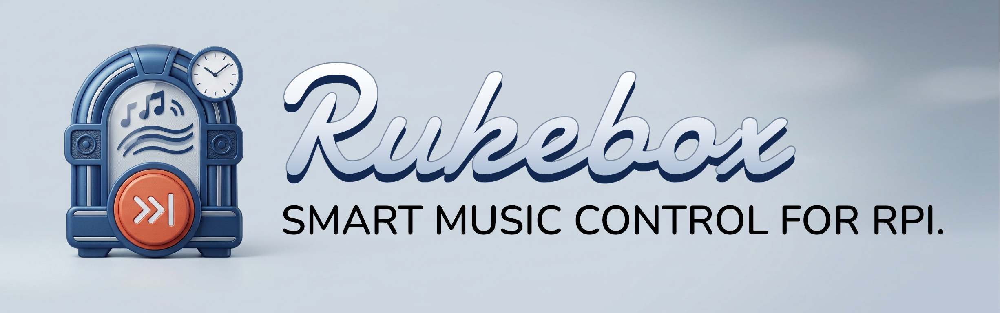
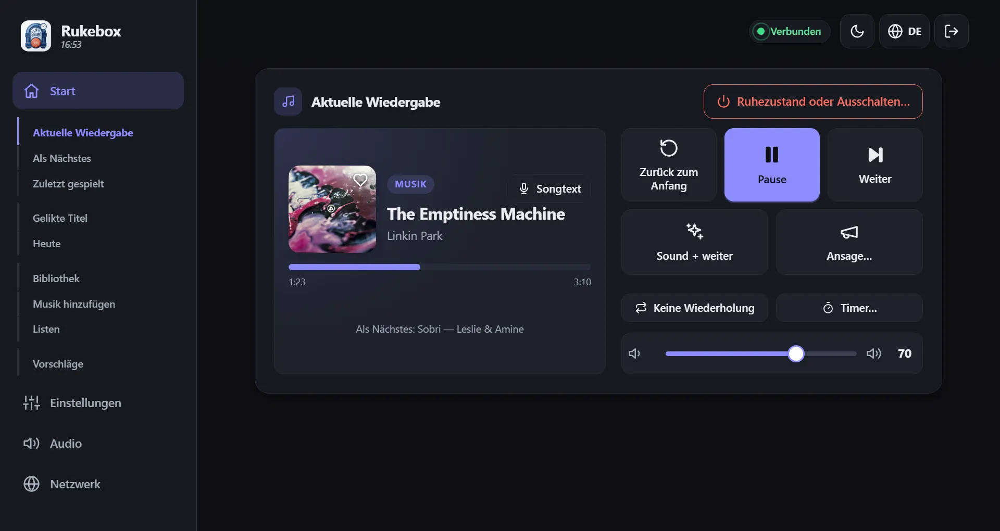
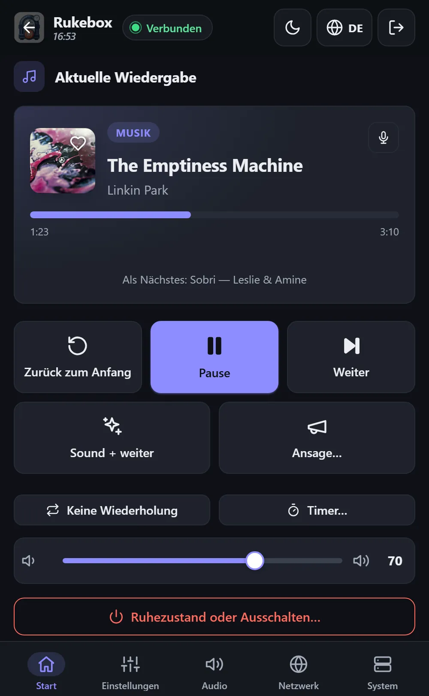
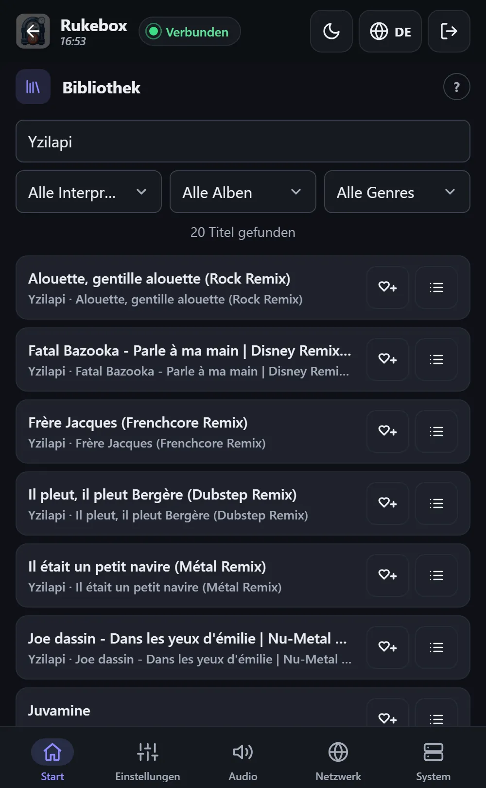

<p align="center"></p>

<p align="center"><a href="README.md">English</a> · <a href="README.fr.md">Français</a> · <b>Deutsch</b> · <a href="README.es.md">Español</a> · <a href="README.it.md">Italiano</a> · <a href="README.nl.md">Nederlands</a></p>

# 📻 Rukebox

Ein Raspberry Pi Zero, ein Bluetooth-Lautsprecher und deine Musik:
Rukebox macht daraus ein kleines Radio, das morgens von selbst startet,
die Ansagen spielt, die du auswählst, und sich abends ausschaltet. Kein
Internet, kein Konto, keine App - eine Taste, die Tasten des
Lautsprechers oder ein beliebiges Handy im WLAN des Pi genügen.

<p align="center"></p>

<p align="center"> &nbsp; </p>

## ✨ Was es kann

- **Startet, wann du willst**: zu einer festen Uhrzeit, wenn sich der
  Lautsprecher verbindet, beim Einschalten oder auf Tastendruck - mit
  sanftem Einblenden.
- **Deine Ansagen**: eine Morgenbegrüßung, ein Jingle zwischen den Titeln,
  eine Erinnerung jede Stunde... jede mit eigenem Zeitplan, und sogar „nur
  jedes zweite Mal“ für eine kleine Überraschung.
- **Eine Taste genügt**: ein Flic-Button, eine Bluetooth-Fernbedienung, ein Taster am Pi, die Tasten des
  Lautsprechers oder die Kopfhörertasten einer USB-Soundkarte - weiter,
  zurück, Pause, Wiederholen, Lautstärke, Sleep-Timer, Ruhezustand.
- **Eine übersichtliche Weboberfläche** auf Handy, Tablet oder Computer:
  der laufende Titel mit Cover und Songtext, was als Nächstes kommt, eine
  durchsuchbare Bibliothek, eigene Listen - alles oder nur bestimmte
  Genres - und alle Einstellungen. Sechs Sprachen, helles und dunkles
  Design.
- **Leicht zu teilen**: Gäste treten dem WLAN per QR-Code bei, reihen
  Titel ein und schlagen neue vor - mit Guthaben, damit niemand das Radio
  für sich allein beansprucht.
- **Auch für den Abend**: es sagt die Uhrzeit an, warnt vor dem
  Abschalten und wird zum Partyspiel - ein Blindtest auf den Handys deiner
  Gäste, eine Abstimmung zum Überspringen und RFID-Karten oder Barcodes,
  die ein Album starten. Ein Monats- und Jahresrückblick zeigt, was du
  gehört hast.
- **Licht, das der Musik folgt**: WLED-Lichtstreifen wechseln die Szene,
  wenn die Musik startet, pausiert oder eine Ansage läuft, pulsieren im
  Takt und teilen die Uhrzeit mit dem Radio.
- **Läuft von allein**: hält den Lautsprecher verbunden, kennt die
  Uhrzeit ohne Internet, überspringt unlesbare Dateien, überwacht seine
  SD-Karte und zeigt an, wenn etwas deine Aufmerksamkeit braucht.
- **Alles bleibt auf dem Pi**: Statistik, Sicherungen und Updates stehen
  bereit, wenn du sie brauchst, und sind nie Pflicht.

## 🧰 Was du brauchst

- Einen Raspberry Pi Zero 2 W (andere Raspberry-Pi-Modelle gehen auch)
- Eine microSD-Karte (ab 8 GB) und ein Netzteil
- Einen Bluetooth-Lautsprecher - oder einen Kabelausgang: Klinke,
  USB-Soundkarte oder HDMI
- Empfohlen: ein DS3231-Uhrmodul, damit der Pi die Uhrzeit ohne Internet
  behält
- Optional: einen Flic-Button oder einen beliebigen Taster am Pi

## 🚀 Los geht's

1. **Karte beschreiben** mit dem [Raspberry Pi Imager](https://www.raspberrypi.com/software/):
   *Raspberry Pi OS Lite* wählen. Wenn du dessen Einstellungen ausfüllst,
   muss der Benutzername `pi` lauten.
2. **Karte vorbereiten**: `dist/rukebox-setup.html` aus der
   [neuesten Version](https://github.com/Arubinu/Rukebox/releases)
   herunterladen, im Browser öffnen, die Karte wählen und ein paar
   Fragen beantworten (WLAN, Zugangspunkt, Zeitzone, Musik).
3. **Pi starten**: Er installiert alles selbst und zeigt den Fortschritt
   auf einer Webseite. Einmal braucht er Internet - über WLAN, ein
   Ethernet-Kabel oder den USB-Anschluss deines Computers.
4. **Verbinden**: Mit dem Handy dem WLAN des Pi beitreten (standardmäßig
   *Rukebox*). Die Oberfläche öffnet sich von selbst, sonst
   `http://10.42.0.1` aufrufen.

Du hast schon einen Raspberry Pi mit SSH-Zugang?

```bash
git clone https://github.com/Arubinu/Rukebox.git && cd Rukebox
sudo ./scripts/install.sh
```

**Kein Pi?** Rukebox läuft mit Docker auch in einem Container (NAS, Mini-PC,
Server) - ohne Access Point, GPIO und Hardware-Uhr:

```bash
docker compose -f docker/compose.stream.yml up -d
```

Gehört wird die Musik über „Hier hören" in der Oberfläche, in VLC oder auf
einem Netzwerklautsprecher. Siehe
[Im Container betreiben](docs/guide.md#running-in-a-container-docker).

## 🎛️ Im Alltag

| Geste | Standard |
|---|---|
| Einfacher Klick | Ein kurzer Ton, dann der nächste Titel (startet die Musik, wenn sie aus ist) |
| Doppelklick | Eine Ansage, dann der nächste Titel |
| Langer Druck | Ausblenden und den Pi ausschalten - oder nur Ruhezustand |

Jede Geste lässt sich ändern, und alles ist auch auf dem Bildschirm
verfügbar. Updates werden mit einem Klick aus der Oberfläche installiert,
wenn der Pi Internet hat, oder vom Computer über das USB-Kabel.

## 📚 Mehr erfahren

- [Referenzhandbuch](docs/guide.md): Installationsvarianten, alle
  Einstellungen, Netzwerk, Updates und Fehlersuche (auf Englisch).
- Tests: `python3 -m unittest discover -s tests`
- Icons: [Lucide](https://lucide.dev), ISC-Lizenz - siehe den [Hinweis](docs/THIRD-PARTY.md).

Ideen und Beiträge sind willkommen - eröffne ein Issue oder einen Pull
Request.
