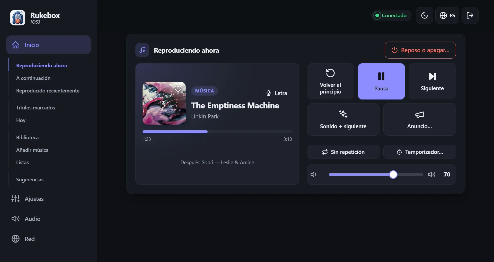
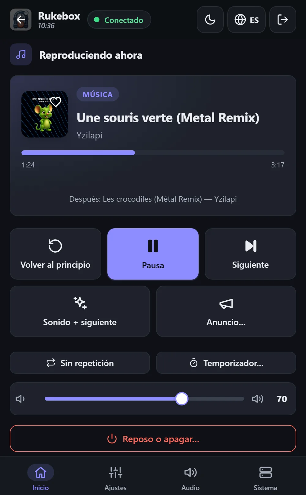
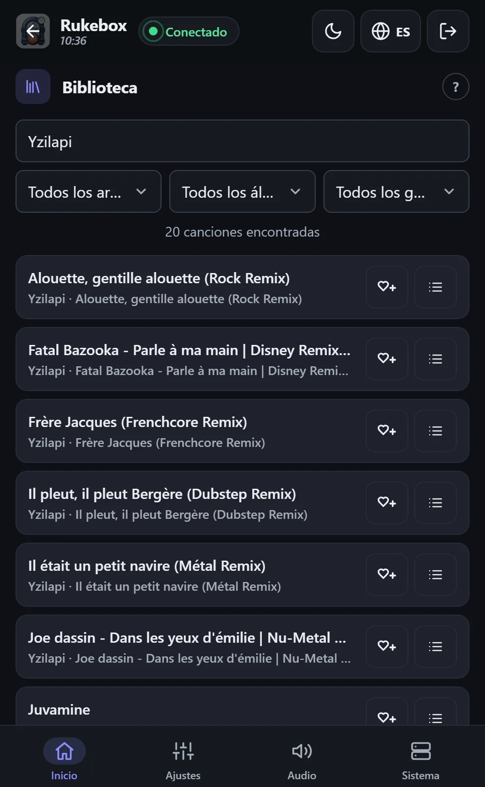

<p align="center"></p>

<p align="center"><a href="README.md">English</a> · <a href="README.fr.md">Français</a> · <a href="README.de.md">Deutsch</a> · <b>Español</b> · <a href="README.it.md">Italiano</a> · <a href="README.nl.md">Nederlands</a></p>

# 📻 Rukebox

Una Raspberry Pi Zero, un altavoz Bluetooth y tu música: Rukebox los
convierte en una pequeña radio que arranca sola por la mañana, reproduce
los anuncios que elijas y se apaga por la noche. Sin Internet, sin cuenta,
sin aplicación que instalar - basta un botón, los botones del altavoz o
cualquier móvil conectado al Wi-Fi de la Pi.

<p align="center"></p>

<p align="center"> &nbsp; </p>

## ✨ Qué hace

- **Arranca cuando quieras**: a una hora fija, cuando se conecta el
  altavoz, al encender o con un botón, con una entrada suave del sonido.
- **Tus anuncios**: un mensaje de buenos días, un jingle entre canciones,
  un recordatorio cada hora... cada uno con su horario, e incluso «una vez
  de cada dos» para dar una pequeña sorpresa.
- **Con un botón basta**: un botón Flic, un pulsador conectado a la Pi o
  los botones del altavoz - siguiente, anterior, pausa, repetición,
  volumen, temporizador, reposo.
- **Una interfaz web clara** en el móvil, la tableta o el ordenador: lo
  que suena con carátula y letra, lo que viene después, una biblioteca
  para buscar, tus propias listas -todo o solo algunos géneros- y todos
  los ajustes. Seis idiomas, tema claro y oscuro.
- **Fácil de compartir**: tus invitados se unen al Wi-Fi escaneando un
  código QR, ponen canciones en cola y proponen otras - con créditos, para
  que nadie acapare la radio.
- **También para la noche**: dice la hora en voz alta, avisa antes de
  apagarse y se convierte en un juego - un test a ciegas en los móviles de
  tus invitados, una votación para saltar la canción y tarjetas RFID o
  códigos de barras que inician un álbum. Un resumen del mes y del año te
  cuenta lo que escuchaste.
- **Pensada para funcionar sola**: mantiene el altavoz conectado, sabe la
  hora sin Internet, salta los archivos ilegibles, vigila su tarjeta SD y
  avisa en pantalla cuando algo necesita tu atención.
- **Todo se queda en la Pi**: estadísticas, copias de seguridad y
  actualizaciones están ahí cuando las necesitas, nunca son obligatorias.

## 🧰 Qué necesitas

- Una Raspberry Pi Zero 2 W (otros modelos de Raspberry Pi también sirven)
- Una tarjeta microSD (8 GB o más) y una fuente de alimentación
- Un altavoz Bluetooth - o una salida por cable: jack, tarjeta de sonido
  USB o HDMI
- Recomendado: un módulo de reloj DS3231, para que la Pi conserve la hora
  sin Internet
- Opcional: un botón Flic, o cualquier pulsador conectado a la Pi

## 🚀 Primeros pasos

1. **Graba la tarjeta** con [Raspberry Pi Imager](https://www.raspberrypi.com/software/)
   eligiendo *Raspberry Pi OS Lite*. Si rellenas sus ajustes, el nombre de
   usuario debe ser `pi`.
2. **Prepara la tarjeta**: descarga `dist/rukebox-setup.html` de la
   [última versión](https://github.com/Arubinu/Rukebox/releases), ábrelo en
   tu navegador, elige la tarjeta y responde a unas preguntas (Wi-Fi, punto
   de acceso, zona horaria, música).
3. **Enciende la Pi**: lo instala todo sola y muestra el progreso en una
   página web. Necesita Internet una sola vez - por Wi-Fi, un cable
   Ethernet o el puerto USB de tu ordenador.
4. **Conéctate**: únete al Wi-Fi de la Pi (*Rukebox* por defecto) con tu
   móvil. La interfaz se abre sola; si no, ve a `http://10.42.0.1`.

¿Ya tienes una Raspberry Pi con acceso SSH?

```bash
git clone https://github.com/Arubinu/Rukebox.git && cd Rukebox
sudo ./scripts/install.sh
```

## 🎛️ En el día a día

| Gesto | Por defecto |
|---|---|
| Clic simple | Un sonido corto y la canción siguiente (inicia la música si está parada) |
| Doble clic | Un anuncio y la canción siguiente |
| Pulsación larga | Baja el volumen poco a poco y apaga la Pi - o solo reposo |

Cada gesto se puede cambiar, y todo está también disponible en pantalla.
Las actualizaciones se instalan desde la interfaz con un clic cuando la Pi
tiene Internet, o desde tu ordenador por el cable USB.

## 📚 Saber más

- [Guía de referencia](docs/guide.md): opciones de instalación, todos los
  ajustes, red, actualizaciones y resolución de problemas (en inglés).
- Pruebas: `python3 -m unittest discover -s tests`
- Iconos: [Lucide](https://lucide.dev), licencia ISC - ver el [aviso](docs/THIRD-PARTY.md).

Las ideas y contribuciones son bienvenidas: abre un issue o un pull
request.
