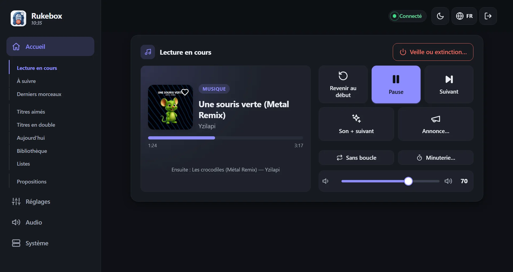

<p align="center"></p>

<p align="center"><a href="README.md">English</a> · <b>Français</b> · <a href="README.de.md">Deutsch</a> · <a href="README.es.md">Español</a> · <a href="README.it.md">Italiano</a> · <a href="README.nl.md">Nederlands</a></p>

# 📻 Rukebox

Un Raspberry Pi Zero, une enceinte Bluetooth et ta musique : Rukebox en
fait une petite radio qui démarre toute seule le matin, diffuse les
annonces que tu choisis et s'éteint le soir. Sans Internet, sans compte,
sans application à installer - un bouton, les boutons de l'enceinte ou
n'importe quel téléphone connecté au Wi-Fi du Pi suffisent.

<p align="center"></p>

<p align="center"> &nbsp; </p>

## ✨ Ce qu'il fait

- **Démarre quand tu veux** : à une heure fixe, à la connexion de
  l'enceinte, au démarrage ou d'un appui sur un bouton, avec une montée
  du son en douceur.
- **Tes annonces** : un message du matin, un jingle entre deux morceaux,
  un rappel toutes les heures... chacune avec son propre horaire, et même
  « une fois sur deux » pour une petite surprise.
- **Un seul bouton suffit** : un bouton Flic, un bouton-poussoir branché
  sur le Pi ou les boutons de l'enceinte - suivant, précédent, pause,
  boucle, volume, minuterie, veille.
- **Une interface web claire** sur téléphone, tablette ou ordinateur :
  lecture en cours avec pochette et paroles, la suite, une bibliothèque
  où chercher, tes propres listes - tout, ou seulement certains genres -
  et tous les réglages. Six langues, thèmes clair et sombre.
- **Facile à partager** : tes invités rejoignent le Wi-Fi en scannant un
  QR code, ajoutent des morceaux à la file et en proposent de nouveaux -
  avec des crédits, pour que personne ne monopolise la radio.
- **Pour les soirées aussi** : il dit l'heure à voix haute, prévient avant
  de s'arrêter et devient un jeu - un blind test sur les téléphones de tes
  invités, un vote pour passer le morceau, et des cartes RFID ou des
  codes-barres qui lancent un album. Un bilan du mois et de l'année te
  raconte ce que tu as écouté.
- **Pensé pour tourner seul** : il garde l'enceinte connectée, connaît
  l'heure sans Internet, ignore les fichiers illisibles, surveille sa
  carte SD et te prévient à l'écran quand quelque chose demande ton
  attention.
- **Tout reste sur le Pi** : statistiques, sauvegardes et mises à jour
  sont là quand tu en as besoin, jamais obligatoires.

## 🧰 Ce qu'il te faut

- Un Raspberry Pi Zero 2 W (les autres Raspberry Pi fonctionnent aussi)
- Une carte microSD (8 Go ou plus) et une alimentation
- Une enceinte Bluetooth - ou une sortie filaire : jack, carte son USB ou
  HDMI
- Conseillé : un module horloge DS3231, pour que le Pi garde l'heure sans
  Internet
- En option : un bouton Flic, ou n'importe quel bouton-poussoir branché
  sur le Pi

## 🚀 Pour commencer

1. **Prépare le système** avec [Raspberry Pi Imager](https://www.raspberrypi.com/software/)
   en choisissant *Raspberry Pi OS Lite*. Si tu remplis ses réglages, le
   nom d'utilisateur doit être `pi`.
2. **Prépare la carte** : télécharge `dist/rukebox-setup.html` depuis la
   [dernière version](https://github.com/Arubinu/Rukebox/releases),
   ouvre-le dans ton navigateur, choisis la carte et réponds à quelques
   questions (Wi-Fi, point d'accès, fuseau horaire, musique).
3. **Démarre le Pi** : il installe tout seul et affiche sa progression sur
   une page web. Il a besoin d'Internet une seule fois - par le Wi-Fi, un
   câble Ethernet ou le port USB de ton ordinateur.
4. **Connecte-toi** : rejoins le Wi-Fi du Pi (*Rukebox* par défaut) avec
   ton téléphone. L'interface s'ouvre toute seule, sinon va sur
   `http://10.42.0.1`.

Tu as déjà un Raspberry Pi accessible en SSH ?

```bash
git clone https://github.com/Arubinu/Rukebox.git && cd Rukebox
sudo ./scripts/install.sh
```

## 🎛️ Au quotidien

| Geste | Par défaut |
|---|---|
| Clic simple | Un court son, puis le morceau suivant (lance la musique si elle est arrêtée) |
| Double clic | Une annonce, puis le morceau suivant |
| Appui long | Arrêt en fondu et extinction du Pi - ou seulement la mise en veille |

Chaque geste se change, et tout est aussi disponible à l'écran. Les mises
à jour s'installent depuis l'interface en un clic quand le Pi a Internet,
ou depuis ton ordinateur par le câble USB.

## 📚 Pour aller plus loin

- [Guide de référence](docs/guide.md) : options d'installation, tous les
  réglages, réseau, mises à jour et dépannage (en anglais).
- Tests : `python3 -m unittest discover -s tests`
- Icônes : [Lucide](https://lucide.dev), licence ISC - voir la [notice](docs/THIRD-PARTY.md).

Les idées et contributions sont les bienvenues - ouvre une issue ou une
pull request.
