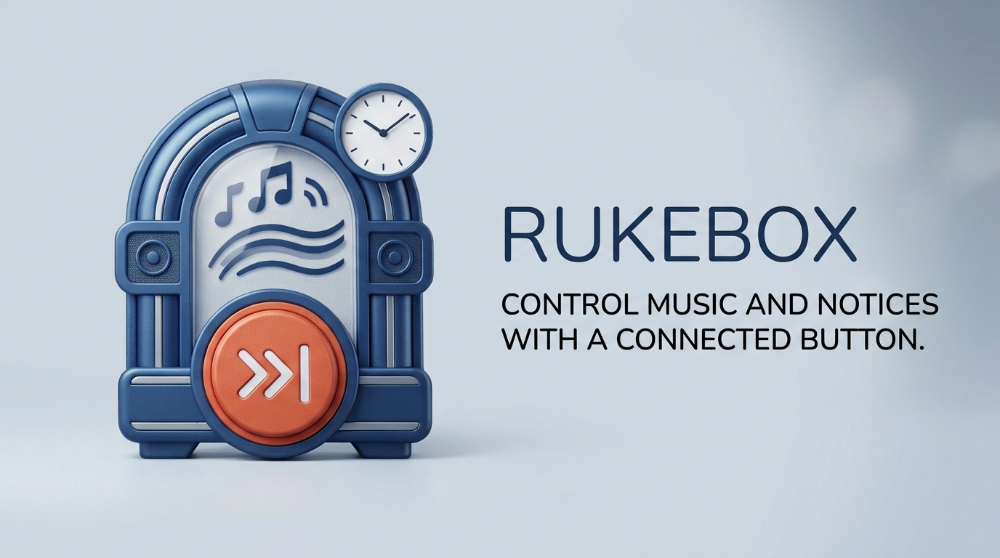
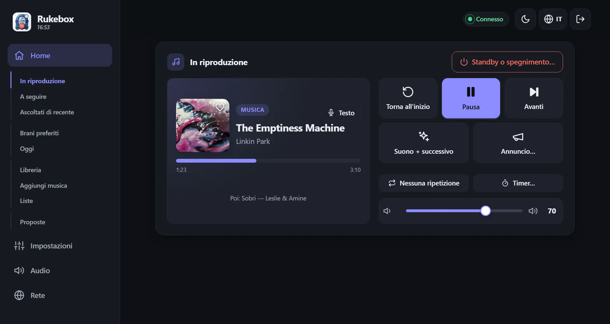
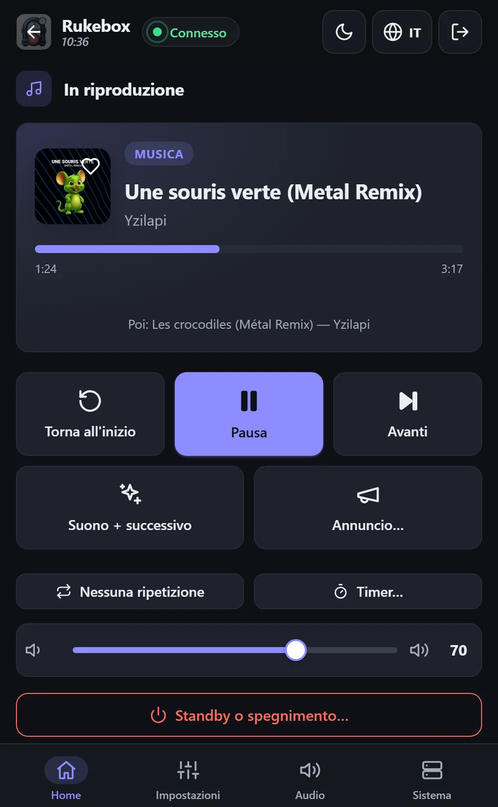
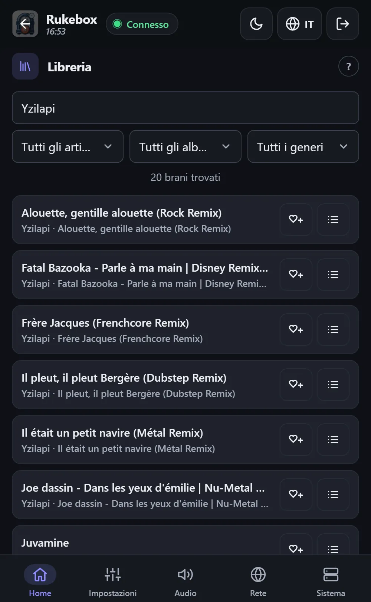

<p align="center"></p>

<p align="center"><a href="README.md">English</a> · <a href="README.fr.md">Français</a> · <a href="README.de.md">Deutsch</a> · <a href="README.es.md">Español</a> · <b>Italiano</b> · <a href="README.nl.md">Nederlands</a></p>

# 📻 Rukebox

Un Raspberry Pi Zero, una cassa Bluetooth e la tua musica: Rukebox li
trasforma in una piccola radio che si avvia da sola al mattino, fa
ascoltare gli annunci che scegli e si spegne la sera. Niente Internet,
nessun account, nessuna app da installare - basta un pulsante, i tasti
della cassa o qualsiasi telefono collegato al Wi-Fi del Pi.

<p align="center"></p>

<p align="center"> &nbsp; </p>

## ✨ Cosa fa

- **Parte quando vuoi**: a un'ora precisa, quando la cassa si collega,
  all'accensione o con un pulsante, con un ingresso graduale del suono.
- **I tuoi annunci**: un messaggio del mattino, un jingle tra un brano e
  l'altro, un promemoria ogni ora... ognuno con il suo orario, e perfino
  «una volta su due» per una piccola sorpresa.
- **Basta un pulsante**: un pulsante Flic, un pulsante collegato al Pi, i
  tasti della cassa o i tasti delle cuffie di una scheda audio USB -
  successivo, precedente, pausa, ripetizione, volume, timer di spegnimento,
  standby.
- **Un'interfaccia web chiara** su telefono, tablet o computer: il brano in
  corso con copertina e testo, cosa viene dopo, una libreria in cui
  cercare, le tue liste - tutto o solo alcuni generi - e tutte le
  impostazioni. Sei lingue, tema chiaro e scuro.
- **Facile da condividere**: gli ospiti si collegano al Wi-Fi scansionando
  un QR code, mettono brani in coda e ne propongono di nuovi - con dei
  crediti, perché nessuno si impossessi della radio.
- **Anche per la sera**: dice l'ora ad alta voce, avvisa prima di
  spegnersi e diventa un gioco - un blind test sui telefoni dei tuoi
  ospiti, un voto per saltare il brano e schede RFID o codici a barre che
  avviano un album. Un bilancio del mese e dell'anno ti racconta cosa hai
  ascoltato.
- **Luci che seguono la musica**: le strisce WLED cambiano scena
  all'avvio della musica, in pausa o durante un annuncio, pulsano a ritmo
  e condividono l'ora con la radio.
- **Pensato per funzionare da solo**: tiene la cassa collegata, conosce
  l'ora senza Internet, salta i file illeggibili, sorveglia la sua scheda
  SD e segnala sullo schermo quando qualcosa richiede attenzione.
- **Tutto resta sul Pi**: statistiche, backup e aggiornamenti ci sono
  quando servono, mai obbligatori.

## 🧰 Cosa serve

- Un Raspberry Pi Zero 2 W (vanno bene anche gli altri modelli)
- Una scheda microSD (8 GB o più) e un alimentatore
- Una cassa Bluetooth - oppure un'uscita via cavo: jack, scheda audio USB o
  HDMI
- Consigliato: un modulo orologio DS3231, perché il Pi mantenga l'ora
  senza Internet
- Facoltativo: un pulsante Flic, o un qualsiasi pulsante collegato al Pi

## 🚀 Per iniziare

1. **Scrivi la scheda** con [Raspberry Pi Imager](https://www.raspberrypi.com/software/)
   scegliendo *Raspberry Pi OS Lite*. Se compili le sue impostazioni, il
   nome utente deve essere `pi`.
2. **Prepara la scheda**: scarica `dist/rukebox-setup.html` dall'
   [ultima versione](https://github.com/Arubinu/Rukebox/releases), aprilo
   nel tuo browser, scegli la scheda e rispondi a qualche domanda (Wi-Fi,
   punto di accesso, fuso orario, musica).
3. **Avvia il Pi**: installa tutto da solo e mostra l'avanzamento su una
   pagina web. Ha bisogno di Internet una sola volta - via Wi-Fi, con un
   cavo Ethernet o dalla porta USB del tuo computer.
4. **Collegati**: entra nel Wi-Fi del Pi (*Rukebox* di default) con il
   telefono. L'interfaccia si apre da sola; altrimenti vai su
   `http://10.42.0.1`.

Hai già un Raspberry Pi con accesso SSH?

```bash
git clone https://github.com/Arubinu/Rukebox.git && cd Rukebox
sudo ./scripts/install.sh
```

**Niente Raspberry Pi?** Rukebox gira anche in un container (un NAS, un
mini-PC, un server) con Docker, senza access point, GPIO e orologio
hardware:

```bash
docker compose -f docker/compose.stream.yml up -d
```

La musica si ascolta con «Ascolta qui» nell'interfaccia, in VLC o su un
diffusore di rete. Vedi
[Eseguire in un container](docs/guide.md#running-in-a-container-docker).

## 🎛️ Nell'uso quotidiano

| Gesto | Di default |
|---|---|
| Clic singolo | Un breve suono, poi il brano successivo (avvia la musica se è ferma) |
| Doppio clic | Un annuncio, poi il brano successivo |
| Pressione lunga | Dissolvenza e spegnimento del Pi - oppure solo standby |

Ogni gesto si può cambiare, e tutto è disponibile anche sullo schermo. Gli
aggiornamenti si installano dall'interfaccia con un clic quando il Pi ha
Internet, oppure dal computer tramite il cavo USB.

## 📚 Per saperne di più

- [Guida di riferimento](docs/guide.md): opzioni di installazione, tutte le
  impostazioni, rete, aggiornamenti e risoluzione dei problemi (in inglese).
- Test: `python3 -m unittest discover -s tests`
- Icone: [Lucide](https://lucide.dev), licenza ISC - vedi l'[avviso](docs/THIRD-PARTY.md).

Idee e contributi sono benvenuti: apri una issue o una pull request.
