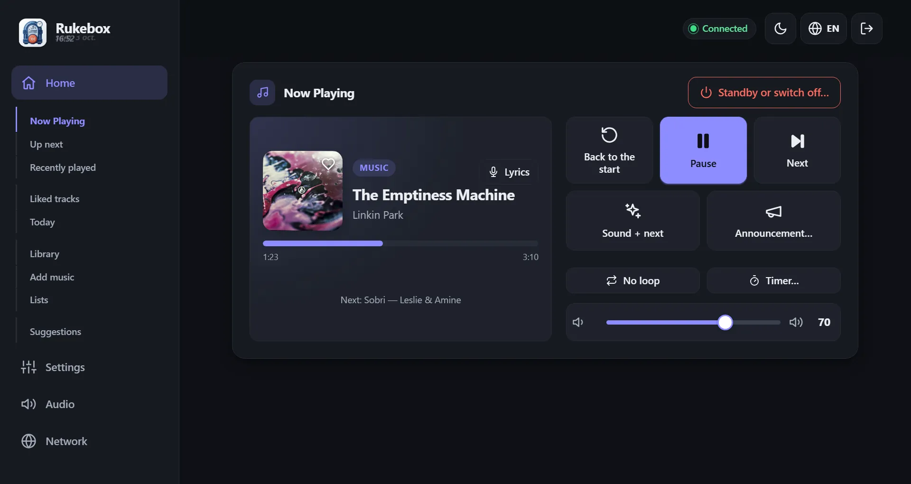
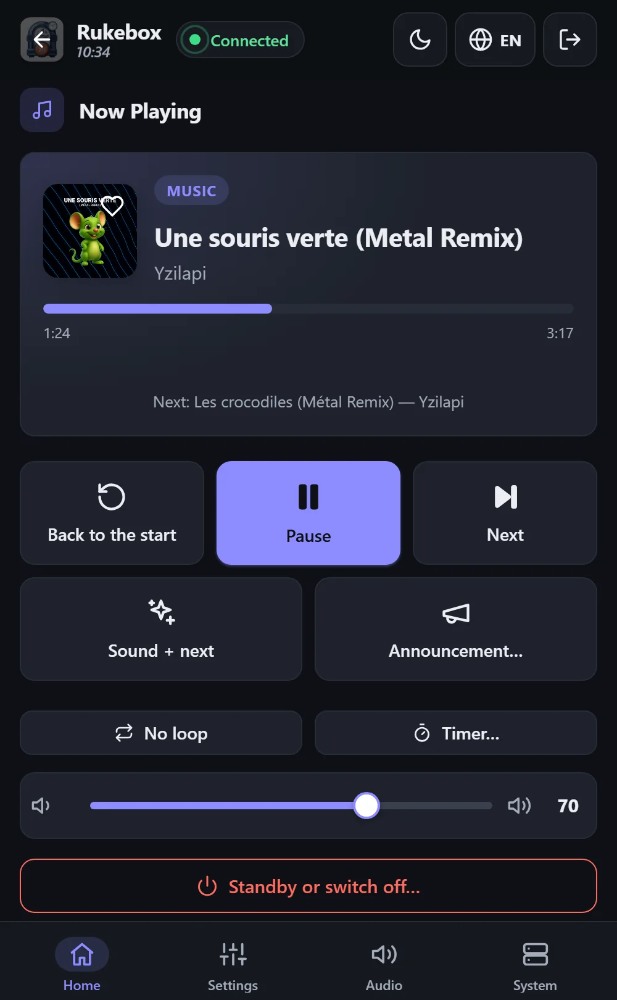
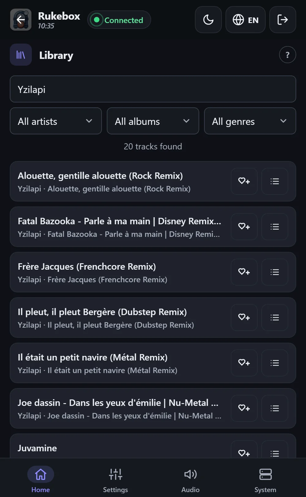

<p align="center"></p>

<p align="center"><b>English</b> · <a href="README.fr.md">Français</a> · <a href="README.de.md">Deutsch</a> · <a href="README.es.md">Español</a> · <a href="README.it.md">Italiano</a> · <a href="README.nl.md">Nederlands</a></p>

# 📻 Rukebox

A Raspberry Pi Zero, a Bluetooth speaker and your music: Rukebox turns them
into a small radio that starts on its own in the morning, plays the
announcements you choose, and switches itself off in the evening. No
Internet, no account, no app to install - a button, the speaker's own
buttons, or any phone through the Pi's own Wi-Fi is all it takes.

<p align="center"></p>

<p align="center"> &nbsp; </p>

## ✨ What it does

- **Starts when you want**: at a set time, when the speaker connects, at
  boot or on a button press, with a gentle fade-in.
- **Your announcements**: a morning message, a jingle between songs, a
  reminder every hour... each on its own schedule, and even "one time out
  of two" for a little surprise.
- **One button is enough**: a Flic button, a push-button wired to the Pi,
  or the speaker's own buttons - next, previous, pause, loop, volume, sleep
  timer, standby.
- **A clear web interface** on phone, tablet or computer: now playing with
  cover and lyrics, what comes next, a searchable library, lists of your
  own - everything, or only some genres - and every setting. Six
  languages, light and dark themes.
- **Easy to share**: guests join the Wi-Fi by scanning a QR code, queue
  songs and suggest new ones - with credits, so nobody takes over.
- **For the evenings too**: it tells the time out loud, warns before it
  stops, and turns into a party game - a blind test on your guests'
  phones, a vote to skip the song, and RFID cards or barcodes that start
  an album. A monthly and yearly recap tells you what you listened to.
- **Made to run unattended**: it keeps the speaker connected, knows the
  time without Internet, skips unreadable files, watches its SD card, and
  says on screen when something needs attention.
- **Everything stays on the Pi**: statistics, backups and updates are
  there when you want them, never required.

## 🧰 What you need

- A Raspberry Pi Zero 2 W (other Raspberry Pi models work too)
- A microSD card (8 GB or more) and a power supply
- A Bluetooth speaker - or a wired output: jack, USB sound card or HDMI
- Recommended: a DS3231 real-time clock module, so the Pi keeps the time
  without Internet
- Optional: a Flic button, or any push-button wired to the Pi

## 🚀 Getting started

1. **Flash the card** with [Raspberry Pi Imager](https://www.raspberrypi.com/software/)
   and choose *Raspberry Pi OS Lite*. If you fill in its settings, the user
   name must be `pi`.
2. **Prepare the card**: download `dist/rukebox-setup.html` from the
   [latest release](https://github.com/Arubinu/Rukebox/releases), open it
   in your browser, select the card and answer a few questions (Wi-Fi,
   access point, time zone, music).
3. **Start the Pi**: it installs everything by itself and shows its
   progress on a web page. It needs Internet once - through Wi-Fi, an
   Ethernet cable or your computer's USB port.
4. **Connect**: join the Pi's Wi-Fi (*Rukebox* by default) with your
   phone. The interface opens by itself, or go to `http://10.42.0.1`.

Already have a Raspberry Pi with SSH access?

```bash
git clone https://github.com/Arubinu/Rukebox.git && cd Rukebox
sudo ./scripts/install.sh
```

**No Pi?** Rukebox also runs in a container (a NAS, a mini-PC, a server) with
Docker, without the access point, the GPIO and the hardware clock:

```bash
docker compose -f docker/compose.stream.yml up -d
```

The music is heard with "Listen here" in the interface, in VLC, or on a
network speaker. See [Running in a container](docs/guide.md#running-in-a-container-docker).

## 🎛️ Everyday use

| Gesture | By default |
|---|---|
| Single click | A short sound, then the next song (starts the music when it is off) |
| Double click | An announcement, then the next song |
| Long press | Fades out and switches the Pi off - or only standby |

Every gesture can be changed, and everything is also available on screen.
Updates install from the interface in one click when the Pi has Internet,
or from your computer over the USB cable.

## 📚 Learn more

- [Reference guide](docs/guide.md): installation options, every setting,
  networking, updates and troubleshooting (in English).
- Tests: `python3 -m unittest discover -s tests`
- Icons: [Lucide](https://lucide.dev), ISC License - see the [notice](docs/THIRD-PARTY.md).

Ideas and contributions are welcome - open an issue or a pull request.
