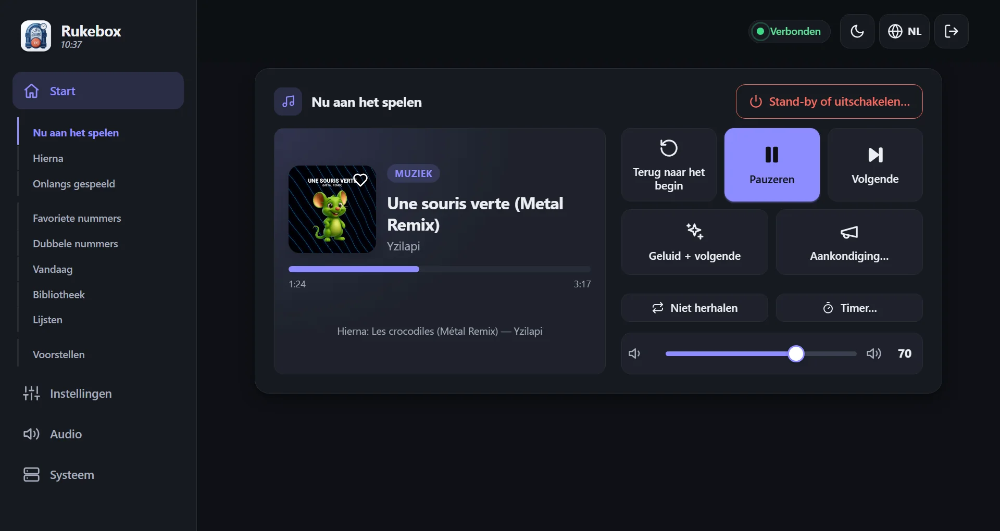
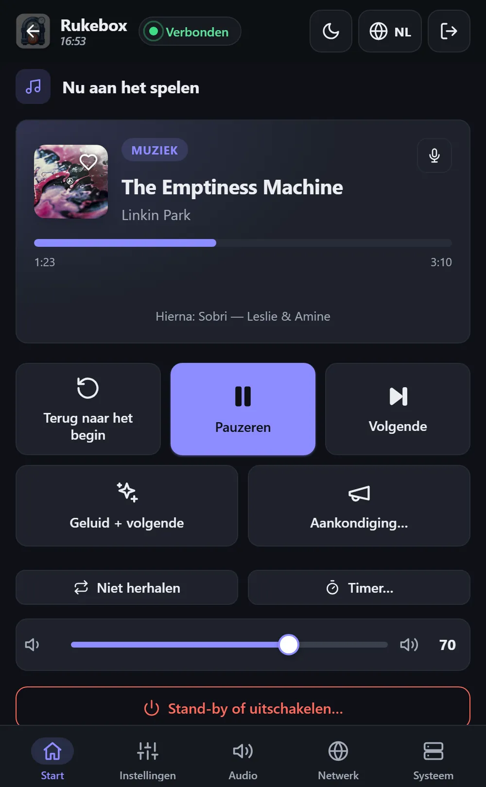
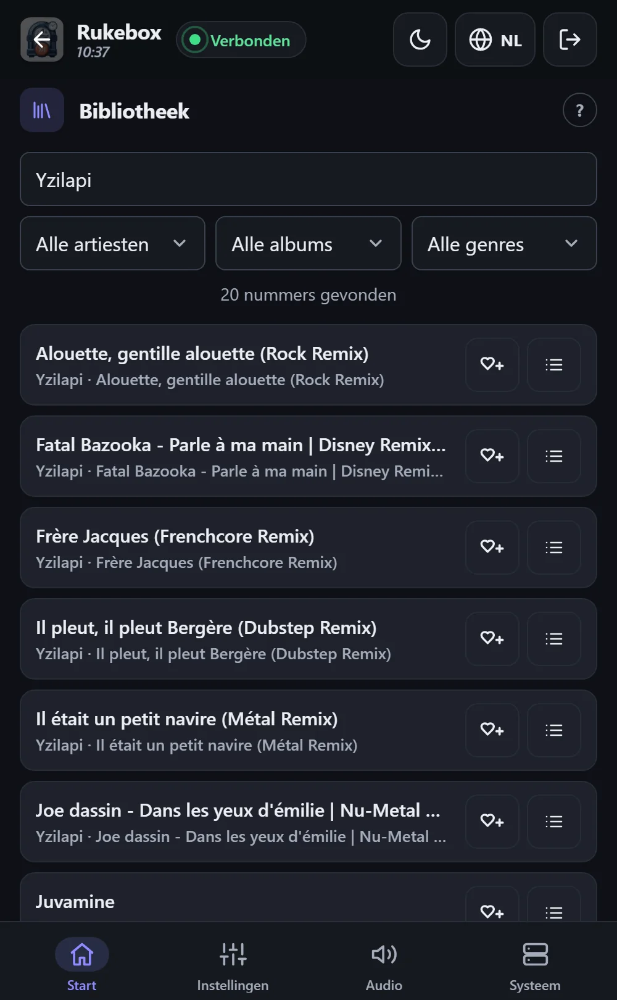

<p align="center"></p>

<p align="center"><a href="README.md">English</a> · <a href="README.fr.md">Français</a> · <a href="README.de.md">Deutsch</a> · <a href="README.es.md">Español</a> · <a href="README.it.md">Italiano</a> · <b>Nederlands</b></p>

# 📻 Rukebox

Een Raspberry Pi Zero, een Bluetooth-speaker en je muziek: Rukebox maakt
er een kleine radio van die 's ochtends vanzelf begint, de aankondigingen
speelt die jij kiest en 's avonds zichzelf uitschakelt. Geen internet,
geen account, geen app om te installeren - een knop, de knoppen van de
speaker of elke telefoon op de wifi van de Pi is genoeg.

<p align="center"></p>

<p align="center"> &nbsp; </p>

## ✨ Wat het doet

- **Begint wanneer jij wilt**: op een vast tijdstip, als de speaker
  verbindt, bij het opstarten of met een druk op de knop - met een zacht
  aanzwellend geluid.
- **Jouw aankondigingen**: een ochtendbericht, een jingle tussen de
  nummers, een herinnering elk uur... elk met een eigen schema, en zelfs
  „één keer op de twee” voor een kleine verrassing.
- **Eén knop is genoeg**: een Flic-knop, een drukknop aan de Pi, de knoppen
  van de speaker of de toetsen van de hoofdtelefoon op een USB-geluidskaart -
  volgende, vorige, pauze, herhalen, volume, slaaptimer, stand-by.
- **Een overzichtelijke webinterface** op telefoon, tablet of computer: wat
  er speelt met hoes en songtekst, wat er hierna komt, een doorzoekbare
  bibliotheek, je eigen lijsten - alles of alleen bepaalde genres - en alle
  instellingen. Zes talen, licht en donker thema.
- **Makkelijk te delen**: gasten verbinden met de wifi via een QR-code,
  zetten nummers in de wachtrij en stellen nieuwe voor - met tegoed,
  zodat niemand de radio overneemt.
- **Ook voor de avond**: hij zegt de tijd hardop, waarschuwt voordat hij
  stopt en wordt een spel - een blinde test op de telefoons van je
  gasten, een stemming om een nummer over te slaan en RFID-kaarten of
  barcodes die een album starten. Een maand- en jaaroverzicht vertelt wat
  je hebt beluisterd.
- **Gemaakt om zelfstandig te draaien**: houdt de speaker verbonden, weet
  hoe laat het is zonder internet, slaat onleesbare bestanden over, houdt
  de SD-kaart in de gaten en meldt op het scherm wanneer iets aandacht
  nodig heeft.
- **Alles blijft op de Pi**: statistieken, back-ups en updates zijn er
  wanneer je ze nodig hebt, nooit verplicht.

## 🧰 Wat je nodig hebt

- Een Raspberry Pi Zero 2 W (andere Raspberry Pi-modellen werken ook)
- Een microSD-kaart (8 GB of meer) en een voeding
- Een Bluetooth-speaker - of een bedrade uitgang: jack, USB-geluidskaart
  of HDMI
- Aanbevolen: een DS3231-klokmodule, zodat de Pi de tijd bijhoudt zonder
  internet
- Optioneel: een Flic-knop, of een willekeurige drukknop aan de Pi

## 🚀 Aan de slag

1. **Schrijf de kaart** met [Raspberry Pi Imager](https://www.raspberrypi.com/software/)
   en kies *Raspberry Pi OS Lite*. Vul je de instellingen daarvan in, dan
   moet de gebruikersnaam `pi` zijn.
2. **Bereid de kaart voor**: download `dist/rukebox-setup.html` van de
   [nieuwste versie](https://github.com/Arubinu/Rukebox/releases), open het
   in je browser, kies de kaart en beantwoord een paar vragen (wifi,
   toegangspunt, tijdzone, muziek).
3. **Start de Pi**: hij installeert alles zelf en toont de voortgang op
   een webpagina. Hij heeft één keer internet nodig - via wifi, een
   ethernetkabel of de USB-poort van je computer.
4. **Verbind**: maak met je telefoon verbinding met de wifi van de Pi
   (standaard *Rukebox*). De interface opent vanzelf, anders ga je naar
   `http://10.42.0.1`.

Heb je al een Raspberry Pi met SSH-toegang?

```bash
git clone https://github.com/Arubinu/Rukebox.git && cd Rukebox
sudo ./scripts/install.sh
```

**Geen Raspberry Pi?** Rukebox draait met Docker ook in een container (een
NAS, een mini-pc, een server) - zonder accesspoint, GPIO en hardwareklok:

```bash
docker compose -f docker/compose.stream.yml up -d
```

De muziek hoor je met "Hier luisteren" in de interface, in VLC of op een
netwerkspeaker. Zie
[In een container draaien](docs/guide.md#running-in-a-container-docker).

## 🎛️ In het dagelijks gebruik

| Gebaar | Standaard |
|---|---|
| Enkele klik | Een kort geluid, dan het volgende nummer (start de muziek als die uit staat) |
| Dubbelklik | Een aankondiging, dan het volgende nummer |
| Lang indrukken | Uitfaden en de Pi uitschakelen - of alleen stand-by |

Elk gebaar is aan te passen, en alles is ook op het scherm beschikbaar.
Updates installeer je met één klik vanuit de interface als de Pi internet
heeft, of vanaf je computer via de USB-kabel.

## 📚 Meer weten

- [Referentiegids](docs/guide.md): installatiemogelijkheden, alle
  instellingen, netwerk, updates en probleemoplossing (in het Engels).
- Tests: `python3 -m unittest discover -s tests`
- Iconen: [Lucide](https://lucide.dev), ISC-licentie - zie de [vermelding](docs/THIRD-PARTY.md).

Ideeën en bijdragen zijn welkom - open een issue of een pull request.
